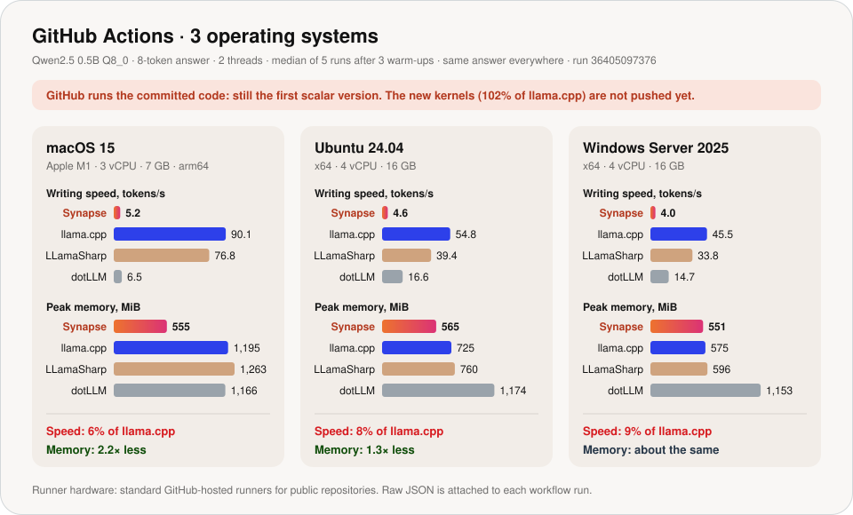
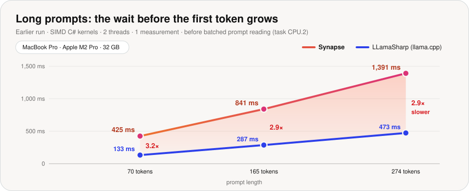

# Synapse

[](https://github.com/managedcode/Synapse/actions/workflows/verify.yml)

**Synapse runs large language models on your own machine, in C# (.NET 10).**
No Python, no server, no network. Later, one model will be split across
several different machines.

## Idea

A fly's brain does not fire every neuron for every signal: a signal takes only
the few regions it needs ([FlyWire connectome](https://doi.org/10.1038/s41586-024-07558-y)).
LLM engines fire everything: every token goes through every block, and every
weight sits in memory. Synapse runs a model like a fly brain.


- **A map of regions:** attention, MLP, each expert, output head.
- **A wave, not a wall:** a token lights up only the regions it needs. A region
  is skipped only with proof: the model's own router, a graph rule, or a
  measured approximation.
- **Cold regions stay on disk** and load on demand, so bigger models fit on
  smaller machines.
- **Precision by importance.** A fast low-precision "reflex" drafts tokens and
  the full model checks them, so the answer stays exact.
- **Regions on different machines.** Only the hidden state travels between
  them: 3.5 KiB per token for Qwen2.5 0.5B.

Today a dense Qwen2.5 runs end to end. Skipping, on-demand loading, and the
cluster are next.

## Architecture


Details: [`docs/Architecture.md`](docs/Architecture.md).

## Benchmark

| Question | Answer |
|---|---|
| Does Synapse write as fast as **llama.cpp**? | **Yes.** 102% of its speed on 2 threads, 114% on 8 threads. |
| Is a whole short request faster? | **Yes, 3.2× faster.** The model loads almost instantly. |
| Does it use less memory? | **Yes, 2.3× less.** |
| Does it start answering fast? | **Short prompts: yes. Long prompts: no, about 3× slower.** Main thing to fix. |
| Is it as fast as **MLX** on the Apple GPU? | **No.** MLX writes 225 tokens/s on the GPU. Synapse has no GPU code yet. |
| How does **Microsoft Foundry Local** do? | **A separate test, 6 models.** With its own ONNX weights on about 6 cores, Qwen2.5 0.5B writes 231 tokens/s and the 7B models 22–25 tokens/s. |
| Is it faster than the other .NET engine, dotLLM? | **Yes, 14× faster.** |

### Where it is tested

| Machine | Chip · CPU | RAM | OS | What runs there |
|---|---|---|---|---|
| MacBook Pro (local) | Apple M2 Pro · 12 cores | 32 GB | macOS 27 | Newest code, all engines, MLX on the GPU, Foundry Local (6 models) |
| GitHub `macos-15` | Apple M1 · 3 vCPU | 7 GB | macOS 15 | Committed code, every performance run; Foundry Local: 3 models that fit (not run yet) |
| GitHub `ubuntu-24.04` | x64 · 4 vCPU | 16 GB | Ubuntu 24.04 | Committed code, every performance run; Foundry Local: all 6 models (not run yet) |
| GitHub `windows-2025` | x64 · 4 vCPU | 16 GB | Windows Server 2025 | Committed code, every performance run; Foundry Local: all 6 models (not run yet) |

### How it is tested

- Every CPU engine loads the same pinned model file: Qwen2.5 0.5B Instruct, Q8_0.
- Same prompt, greedy decoding, same number of threads.
- Each sample is a fresh process: 3 warm-ups, then 5 measured runs, with the
  engine order rotated every round.
- If any engine gives a different answer, the run fails.

### Local Mac, newest code


### GitHub Actions, committed code



### Long prompts



### Microsoft Foundry Local, 6 models


- Qwen, Phi, Mistral, and DeepSeek-R1 from Microsoft's Foundry catalog, run
  through the Foundry Local C# SDK. Model list:
  [`foundry-local-families.json`](benchmarks/model-sets/foundry-local-families.json).
- Each model and scenario gets its own fresh process. The context is capped at
  1,024 tokens: by default Foundry reserves memory for the whole context window
  up front (Phi-3.5-mini: 98 GiB, 12 s to the first token).
- On GitHub, every runner and model pair is a separate job, and a model runs
  only where its file fits in half the RAM.

### What to improve, and where

| | Problem | Fix | Where |
|---|---|---|---|
| 🔴 | Long prompts: first token about 3× slower | Read the prompt in batches (task CPU.2) | `Qwen2CpuExecutor.Prefill` |
| 🔴 | No GPU | Metal kernels | not started |
| 🟡 | GitHub still measures the old scalar build | Commit the new kernels, rerun the performance workflow | `.github/workflows/performance.yml` |
| 🟡 | Takes token IDs, not text | Tokenizer and chat templates | not started |
| 🟡 | Only Qwen2 runs | More model families | `src/Synapse.Runtime/Features/TextGeneration` |
| 🟢 | Speed, memory, startup | Confirm with the 30-run release gate | `experiments/Synapse.ReferenceBenchmarks` |

All runs and raw data: [`benchmarks/README.md`](benchmarks/README.md).

## Plans


Plan files: [`synapse.plan.md`](synapse.plan.md),
[`cpu-kernels.plan.md`](cpu-kernels.plan.md),
[`flybrain.plan.md`](flybrain.plan.md),
[`elastic-inference.plan.md`](elastic-inference.plan.md),
[`kv-performance.plan.md`](kv-performance.plan.md).

## Run it

```bash
dotnet run --project src/Synapse.Cli -- model fetch --set smoke
```

```bash
dotnet run --project src/Synapse.Cli --configuration Release -- generate --model artifacts/models/qwen2.5-0.5b-instruct-q8_0/qwen2.5-0.5b-instruct-q8_0.gguf --tokens 785,6722,315,9625,374 --max-tokens 8
```

Needs .NET SDK 10.0.401 and Rust 1.98.1. All commands are in
[`AGENTS.md`](AGENTS.md#canonical-commands).

## Credits

- **Compared against:** [llama.cpp](https://github.com/ggml-org/llama.cpp),
  [Microsoft Foundry Local](https://github.com/microsoft/Foundry-Local),
  [MLX](https://github.com/ml-explore/mlx-swift-lm) via
  [SwiftLM](https://github.com/SharpAI/SwiftLM),
  [LLamaSharp](https://github.com/SciSharp/LLamaSharp),
  [dotLLM](https://github.com/kkokosa/dotLLM) (GPL-3.0, run as a separate
  process only).
- **Built with:** [.NET](https://github.com/dotnet/runtime),
  [Rust](https://github.com/rust-lang/rust),
  [ZoneTree](https://github.com/ZoneTree/ZoneTree),
  [Orleans](https://github.com/dotnet/orleans),
  [TUnit](https://github.com/thomhurst/TUnit),
  [Qwen2.5](https://huggingface.co/Qwen/Qwen2.5-0.5B-Instruct-GGUF).
- **Ideas from:** [FlyWire connectome](https://doi.org/10.1038/s41586-024-07558-y),
  [Mixture-of-Depths](https://arxiv.org/abs/2404.02258),
  [LayerSkip](https://github.com/facebookresearch/LayerSkip),
  [MoE offloading](https://arxiv.org/abs/2312.17238),
  [BitNet b1.58](https://arxiv.org/abs/2402.17764),
  [BiLLM](https://arxiv.org/abs/2402.04291),
  [SpQR](https://arxiv.org/abs/2306.03078),
  [PTQ1.61](https://arxiv.org/abs/2502.13179),
  [QSpec](https://arxiv.org/abs/2410.11305).
