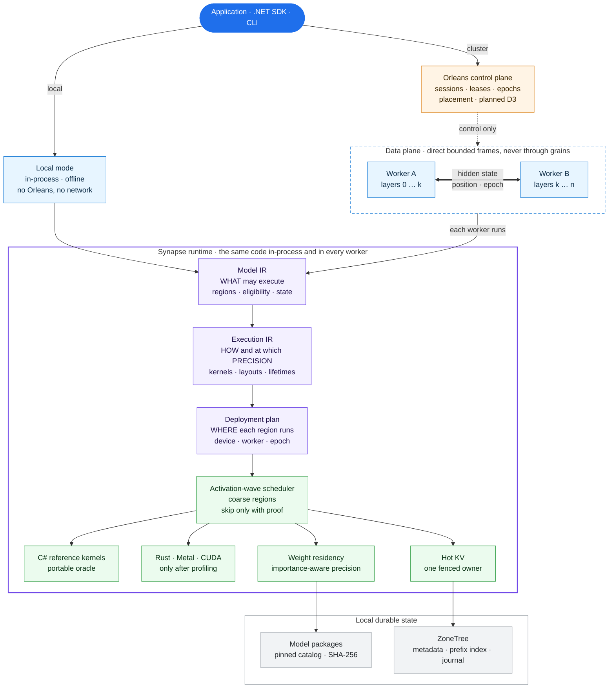

# Synapse

[](https://github.com/managedcode/Synapse/actions/workflows/verify.yml)

**Synapse is a local-first, graph-native LLM inference engine for .NET.** It runs
models on one machine without any server or network. The same runtime is meant
to scale across a cluster of different machines (an Apple Silicon Mac, an
NVIDIA box, an ordinary PC), with Orleans coordinating and tensors moving
directly between workers.

Synapse owns the whole path: model import, a typed graph of the model, graph
execution, memory and KV state, scheduling, quantization, sampling, worker
transfer, and benchmark evidence. dotLLM, LLamaSharp, and native llama.cpp are
competitors measured by the harness. They are never hidden Synapse backends.

## The idea

Most engines treat a model as a fixed stack of layers and try to make each
matrix multiply faster. Synapse also optimizes **how much of the model has to
run and be resident** for a given request.

- **Model = graph of coarse regions.** An embedding, each attention block, each
  MLP block, each MoE expert, and the output head are regions with explicit
  inputs, outputs, weights, and state. This is the FlyBrain idea, borrowed
  loosely from how a fly brain's connectome routes signals through a few active
  areas.
- **Inference = an activation wave.** Only the regions a request actually needs
  execute. A region may be skipped only with proof: a graph predicate, the
  model's own trained router (as in MoE), or an evaluated approximation
  profile. A label such as `CSharp` or `Reasoning` never authorizes skipping,
  and dense checkpoints stay dense.
- **Four independent decisions per request:** *what* runs (regions), *which
  weights* are resident in memory (demand loading), *where* each region runs
  (device or worker), and *at what precision* (encoding per tensor).
- **Important weights keep full precision; unimportant ones may be
  approximate.** Importance is measured as the output error an approximation
  causes on real activations. Precision can drop as low as ternary where
  measurement allows. It returns automatically when it matters: a
  full-precision pass verifies approximate drafts, and freed memory promotes
  the most important demoted tensors first.
- **One model across heterogeneous machines.** Layer ranges are placed on
  devices according to measured speed, memory, and supported kernels. Orleans
  holds only control state (sessions, leases, epochs, placement). The hidden
  state crosses between workers directly (3.5 KiB per token for Qwen2.5-0.5B);
  tensors never go through grains.
- **Evidence first.** Every speed, memory, or quality claim needs raw paired
  measurements. `not_run` never counts as `passed`.

## Built with

| Layer | Technology | Role |
|---|---|---|
| Runtime, graph IR, reference kernels, SDK, CLI | C# / .NET 10 (`net10.0`, nullable, warnings as errors) | The first and permanent portable path; the numerical oracle |
| Optimized hot paths | Rust 1.98 (edition 2024) | Kernels, allocator, hot KV, or transfer, only after a paired profile shows the C# path is the bottleneck |
| GPU kernels | Metal, CUDA (planned) | Behind the same region and precision contracts |
| Cluster control plane | Microsoft Orleans (planned D3) | Sessions, leases, epochs, placement, recovery; no tensor traffic |
| Durable local state | ZoneTree | Package and cache metadata, prefix index, journals, evidence index |
| Tests | TUnit on Microsoft.Testing.Platform | Real components and real models; no mocks |
| Forbidden | Python, Node.js | Not used for build, runtime, conversion, tests, or benchmarks |

## What works today, and what is planned

| Capability | Status | Where |
|---|---|---|
| Managed Qwen2 Q8_0 inference (24 layers: RMSNorm, Q8_0 GEMV, GQA, RoPE, KV, SwiGLU, greedy), with an 8-token continuation identical to dotLLM, LLamaSharp, and native llama.cpp | **Working** | `src/Synapse.Runtime/Features/TextGeneration` |
| Typed Model IR and verifier: regions, derived boundaries, explicit operation attributes and position, `Context` symbol, graph fingerprint, weight byte ranges, ADR-003 activation contract | **Working** | `src/Synapse.Contracts`, `Features/GraphExecution` |
| Scalar reference interpreter from Model IR (tiny fixed-shape graphs) | **In progress**; Qwen does not execute from IR yet | `Features/GraphExecution/Reference` |
| Pinned model catalog and verified download | **Working** | `models/catalog.json`, `synapse model` |
| Source-format decoders (F32/F64/F16/BF16, FP8 E4M3/E5M2, GGUF Q4_0–Q8_0, Q2_K–Q6_K, Q8_K, IQ4_NL/IQ4_XS, TQ1_0/TQ2_0, MXFP4), diffed against ggml's own decoders | **Implemented**, not yet wired into tensor reads | `Features/ModelPackages/SourceFormats` |
| On-the-fly quantization: symmetric 2–8-bit codecs with any group size, ternary, activation-aware importance, budget selector with automatic promotion | **Implemented**, not yet wired into execution | `Features/Quantization` |
| Heterogeneous placement planner (up to 4 devices, KV reservation, precision per stage, latency or throughput objective) | **Implemented** on supplied profiles; no Orleans yet | `Features/ExecutionPlanning` |
| Region scheduler that executes and skips regions; region kernels | Planned (F1) | `flybrain.plan.md` |
| Weight residency and demand loading under a memory budget | Planned (F2) | `flybrain.plan.md` |
| Paged hot KV chosen by measurement (C# vs Rust) | Planned | `kv-performance.plan.md` |
| Speculative decoding and exact precision escalation | Planned (F4, E5) | `flybrain.plan.md`, `elastic-inference.plan.md` |
| Real MoE expert routing and expert paging (OLMoE) | Planned (F5) | `flybrain.plan.md` |
| Concurrent sessions with region-level batching | Planned (E7) | `elastic-inference.plan.md` |
| Orleans cluster: multi-process, then two nodes | Planned (F6, E8) | `flybrain.plan.md`, `elastic-inference.plan.md` |
| Repo-owned tokenizer and chat templates; the CLI takes token IDs today | Planned | `synapse.plan.md` |
| Metal and CUDA kernels | Planned | `synapse.plan.md` |

### Current checkpoint in detail

The first executable slice is real: Synapse loads the pinned
Qwen2.5-0.5B-Instruct Q8_0 GGUF, verifies a 26-region dense Model IR, and runs
the full 24-layer forward/decode path in managed C#. RMSNorm, Q8_0 matrix/vector
math, GQA, RoPE, KV state, SwiGLU, logits, and greedy sampling all execute in
this repository. The verifier derives every region boundary from real
producer/consumer, tensor, and state dependencies instead of trusting the model
adapter's declaration. RMS epsilon, RoPE layout/theta/head width, attention
heads/scale/mask, and decode position are explicit typed IR inputs rather than
model-side hidden state. KV slots use a model-bounded `Context` symbol, and a
versioned canonical SHA-256 fingerprint identifies the Model IR independently
of a session's requested context capacity. Every region-required weight resolves
to a package-relative GGUF byte range, logical shape, and F32 or Q8_0 encoding.
The activation contract records the graph decision, provenance, and skipped
output behavior. The verifier checks route causality, bypass shapes, tolerant
merges, and KV position holes before an execution plan can use them.
Its eight-token continuation matches dotLLM and LLamaSharp.

## Architecture



The four independent decisions are: what graph regions are mathematically
eligible, which weights are resident, where a region runs, and at what legal
precision. Dense checkpoints stay dense. A semantic label such as `CSharp` or
`Reasoning` never authorizes skipping work. Orleans accepts and coordinates
distributed requests, leases, region placement, and weight-group ownership;
large tensors and KV payloads do not pass through grains.

C# remains the portable oracle and first implementation. Rust becomes the
optimized owner of a kernel, allocator, hot-KV operation, or transfer path only
after a paired profile shows that the managed path is the bottleneck. See
[`docs/Architecture.md`](docs/Architecture.md) and the reviewed FlyBrain plan
in [`flybrain.plan.md`](flybrain.plan.md).

## Precision: demote what does not matter, restore what does

These building blocks are implemented and tested, but not yet wired into
execution. See [`docs/Features/Quantization.md`](docs/Features/Quantization.md).

1. **Any source format in.** A model arrives in its own encoding (BF16
   SafeTensors, GGUF Q8_0, Q4_K, and so on). `SourceFormats` decodes it to FP32
   reference values. An unsupported type fails at import with its ggml name,
   never silently.
2. **Any target precision out.** `syn.q{2..8}.symmetric.g{8..1024}.v1` covers
   every width from 2 to 8 bits with any group size. `syn.ternary.absmean.g64.v1`
   uses the BitNet b1.58 absmean rule per group. Each has a scalar reference
   encoder, decoder, and matrix-vector product.
3. **Measure importance.** For each tensor, `PrecisionCandidates.Measure`
   quantizes on the fly with every candidate codec. It records the stored bytes
   and the relative output error `||(W − Q(W))X||² / ||WX||²` on calibration
   activations `X`. The error is weighted by activations, so a column that real
   inputs never use costs almost nothing to approximate.
4. **Fit a budget.** `PrecisionBudgetSelector` starts every tensor at source
   precision and demotes the least important first, down the ladder source → q8
   → q6 → q4 → q3 → q2/ternary, until the device's memory budget fits.
   - It respects the device's supported kernels and pinned tensors.
   - It requires an explicit approximation opt-in.
   - It returns a `ProfileHash` that identifies the effective weights for plan
     and KV cache keys.
5. **Restore automatically.** The demotion order does not depend on the budget.
   More memory therefore restores the most important demoted tensors first, and
   `Diff` lists exactly what to reload. The planned exact mode drafts with the
   approximate profile and verifies with full precision, so the committed output
   equals the full model's greedy output.

A caveat, with evidence recorded in
[`elastic-inference.plan.md`](elastic-inference.plan.md):
- Plain post-training quantization of a trained model to ternary collapses
  quality.
- BitNet models reach 1.58 bits because they are *trained* ternary.
- Ternary in Synapse is therefore only for tensors that measurement shows to
  be insensitive, behind verification or a quality gate, plus native import of
  models trained ternary.

## Spreading one model over different machines

`HeterogeneousPlacementPlanner` splits the layer regions of a model into
contiguous stages over up to four devices. The devices can differ in memory,
measured weight-streaming speed, dispatch overhead, and supported encodings.
- Each stage reserves KV for the requested context.
- Each stage gets the highest importance-aware precision that fits.
- `Latency` minimizes one request's step time, which tends to keep the model on
  the fastest device that fits.
- `Throughput` balances a pipeline serving many parallel requests. In the tests,
  a 3× faster device receives 9 of 12 layers.

Orleans will run this planner when workers join or leave, store the plan with
an epoch, and hold the leases. Workers then pass the hidden state directly to
each other. See
[`docs/Features/ExecutionPlanning.md`](docs/Features/ExecutionPlanning.md).

## Model packages, not model blobs in Git

`models/catalog.json` pins immutable upstream revisions, every required file,
exact byte lengths, SHA-256 digests, architecture, precision, license, and
download sets. `synapse model fetch` permits only bounded HTTPS redirects to
trusted source/storage hosts, stops oversized payloads before writing beyond
the declared length, verifies hashes, and atomically publishes each file.
Downloaded weights live under ignored `artifacts/models/`; Git and Git LFS do
not carry model payloads.

```text
dotnet run --project src/Synapse.Cli -- model list
dotnet run --project src/Synapse.Cli -- model fetch --set family-small
dotnet run --project src/Synapse.Cli -- model fetch --set embedding-small
dotnet run --project src/Synapse.Cli -- model fetch --set architecture-small
dotnet run --project src/Synapse.Cli -- model fetch --set medium
```

| Catalog set | Pinned models | Architecture coverage | Current Synapse support |
|---|---|---|---|
| `smoke` | [Qwen2.5 0.5B Q8_0](https://huggingface.co/Qwen/Qwen2.5-0.5B-Instruct-GGUF) (676 MB) | Qwen2 dense Transformer | Full managed GGUF inference |
| `family-small` | Qwen2.5 0.5B, [SmolLM2 135M BF16](https://huggingface.co/HuggingFaceTB/SmolLM2-135M-Instruct) | Qwen2, Llama | Qwen2 executes; SmolLM SafeTensors index is verified |
| `architecture-small` | [Qwen3 0.6B Q8_0](https://huggingface.co/Qwen/Qwen3-0.6B-GGUF), [Mamba 130M F32](https://huggingface.co/state-spaces/mamba-130m-hf) | Qwen3 Transformer, attention-free SSM | Reproducible packages; executors planned |
| `embedding-small` | [all-MiniLM-L6-v2](https://huggingface.co/sentence-transformers/all-MiniLM-L6-v2), [BGE-small-en-v1.5](https://huggingface.co/BAAI/bge-small-en-v1.5) | BERT encoders | Real SafeTensors indexes verified; embedding execution planned |
| `medium` | [Phi-3 Mini 3.8B Q4](https://huggingface.co/microsoft/Phi-3-mini-4k-instruct-gguf), [DeepSeek-R1-Distill-Qwen 1.5B BF16](https://huggingface.co/deepseek-ai/DeepSeek-R1-Distill-Qwen-1.5B), [Ministral 3 3B Q4](https://huggingface.co/mistralai/Ministral-3-3B-Instruct-2512-GGUF) | Phi3, Qwen2 distill, Mistral3 | Complete pinned packages; medium execution/performance gate planned |

The DeepSeek distill model is architecturally Qwen2; it is not evidence for
native DeepSeek-V2/V3 MLA+MoE support. MiniMax remains an architecture target,
not a local fixture: current MiniMax text models are large hybrid/MoE models,
so presenting one as a small 32 GB smoke model would be misleading. Gemma
fixtures are also excluded from unattended CI until their gated license is
accepted. Mamba gives the small suite a genuinely different state-space model,
not another renamed dense Transformer.

## Measured Mac benchmark

Machine: MacBook Pro, Apple M2 Pro (12 CPU cores: 8 performance + 4
efficiency; 19-core GPU), 32 GB unified memory, macOS 27.0 arm64. The run used
AC power with Low Power Mode off; GPU acceleration was not used.

Workload: pinned Qwen2.5-0.5B-Instruct Q8_0, prompt `The capital of France is`
(`785,6722,315,9625,374`), greedy generation, 8 new tokens, 512-token context,
and the same 12-thread cap. Every sample starts a new process. Results are the
median of 5 measured runs after 3 warm-ups, with subject order rotated each
round.

| Subject | Load ms | TTFT ms | Generation ms | Decode tok/s | Process wall ms | Avg CPU cores | Max observed RSS |
|---|---:|---:|---:|---:|---:|---:|---:|
| Synapse managed CPU | **56.1** | 328.3 | 633.3 | **24.30** | **691.3** | 10.23 | **559.8 MiB** |
| dotLLM `d880404` CPU | 345.5 | 439.6 | 875.6 | 18.22 | 1,352.5 | 5.66 | 1,190.5 MiB |
| LLamaSharp 0.27.0 CPU | 691.2 | **17.2** | **69.0** | **136.16** | 780.9 | 1.76 | 1,137.2 MiB |

All five runs generated eight tokens. Synapse produced token IDs
`12095, 13, 1084, 374, 279, 7772, 3283, 304`; both tokenizing baselines decoded
the same continuation as ` Paris. It is the largest city in`.

These numbers are diagnostic evidence, not a release victory claim. Synapse
currently loads fastest, uses less than half the maximum observed working set,
and beats dotLLM decode throughput at the equal 12-thread setting; LLamaSharp/
llama.cpp remains far ahead in TTFT and decode. Synapse TTFT varied from 304.8
to 574.2 ms, so scheduling stability is an explicit optimization target. The
formal benchmark gate still requires 30 paired measurements, a thread-scaling
sweep, the locked 10-turn growing-context dialogue, cache hit/miss workloads,
and embeddings. Energy is
`not_run_missing_privilege`: `/usr/bin/powermetrics` requires superuser access,
and missing energy data is never reported as zero.

Direct native `llama.cpp` 0.4.1 (`b29c606e2`) now passes the same Qwen prompt
token IDs and eight-token continuation. It was measured separately, not
interleaved with the three-subject run above, so it is **not a fourth paired
row** in that table. After three warm-ups, five fresh-process native runs had
median process wall 566.2 ms and max observed RSS 1,208.3 MiB. The native CLI
reported median prompt-eval 14.9 ms and eval 57.9 ms (120.84 eval tok/s).
These are native internal phases, **not** comparable load, TTFT, or end-to-end
generation measurements; those fields remain `null`. For a 128-token output,
five measured native completion runs ranged from 47.28 to 99.40 internal eval
tok/s (median 80.73), with identical generated text. This large spread is a
reason to avoid a winner claim while the Mac also runs other development work.
One later repeat exceeded 90 seconds for the same 128-token limit and was
terminated; it is not folded into the five successful samples.
Separately, native `llama-bench` reported 115.36 ± 5.94 tok/s for five
128-token repetitions; [its own methodology](https://github.com/ggml-org/llama.cpp/blob/master/tools/llama-bench/README.md)
excludes tokenization and sampling, so it is a kernel diagnostic, not a
completion-process result.

### Whole-process memory diagnostic (new run)

A separate C# matrix runner rotated all four CPU subjects through 3 warm-up
and 5 measured fresh-process rounds on this Mac, with 8 threads, the same
Qwen GGUF and matching eight-token continuation. Medians below are from
[the raw 32 samples](benchmarks/results/2026-09-28-m2-pro-qwen2.5-0.5b-q8_0-four-subject-memory-clr-smoke.json).
Power/thermal and competing-load state were not captured for this run, so it
has **no statistical winner verdict** and must not be merged with the earlier
12-thread table.

| Subject · CPU | Peak RSS MiB | Peak physical footprint MiB | CLR live heap MiB | Matrix process wall ms |
|---|---:|---:|---:|---:|
| Synapse | 560.8 | 39.9 | 20.4 | 895.1 |
| dotLLM | 1,187.3 | 663.1 | not instrumented | 1,350.9 |
| LLamaSharp | 1,274.9 | 606.9 | 1.1 | 962.6 |
| direct llama.cpp | 1,258.6 | 594.6 | not applicable | 681.6 |

Peak RSS includes managed, native, and file-backed resident pages. macOS
physical footprint is a different accounting view; for example, Synapse's
mapped model raises RSS far above its footprint. CLR heap is a diagnostic
subset, **not** total .NET memory; subtracting it from RSS does not yield
native allocations. The raw JSON also preserves virtual-size availability,
sample counts, executable/model hashes, and each subject's original result.
Profilers are run separately so their overhead does not contaminate this
table.

The separate [GitHub Actions performance run](https://github.com/managedcode/Synapse/actions/runs/36403943949)
also completed on macOS ARM64, Ubuntu x64, and Windows x64. Each runner used
the same pinned Qwen GGUF (SHA-256 `ca59ca7f13d0e15a8cfa77bd17e65d24f6844b554a7b6c12e07a5f89ff76844e`),
the five prompt IDs above, eight matching output tokens, a two-thread cap,
three warm-ups, and five measured fresh-process rounds. The run publishes one
raw JSON artifact per OS; these are **separate hardware cohorts**, not a
cross-OS leaderboard or a long-generation performance verdict.

| GitHub runner | Synapse wall / RSS | dotLLM wall / RSS | LLamaSharp wall / RSS | llama.cpp wall / RSS |
|---|---:|---:|---:|---:|
| macOS 15 ARM64 | 3,769.5 ms / 554.6 MiB | 2,993.8 ms / 1,166.3 MiB | 1,249.4 ms / 1,266.4 MiB | 1,058.6 ms / 1,204.4 MiB |
| Ubuntu 24.04 x64 | 3,488.3 ms / 565.5 MiB | 2,031.7 ms / 1,174.3 MiB | 770.1 ms / 760.4 MiB | 656.4 ms / 724.3 MiB |
| Windows Server 2025 x64 | 3,626.5 ms / 550.9 MiB | 2,275.9 ms / 1,152.8 MiB | 1,105.0 ms / 596.1 MiB | 984.6 ms / 574.6 MiB |

All four continuations matched on each runner. The table shows medians of
whole-process wall and peak resident set; native/managed allocations and mmap
residency are included in RSS. The separate performance workflow saves the
full raw rounds, workloads, hashes, and memory diagnostics, while `verify.yml`
reports only correctness tests. Its quality gate fails a mismatched performance
run without discarding raw evidence.

The [32-token quality diagnostic](benchmarks/results/2026-09-28-m2-pro-qwen2.5-0.5b-q8_0-32tok-quality-divergence-final.json)
is `ineligible_quality_mismatch`: dotLLM's continuation diverged from
LLamaSharp/direct llama.cpp after a shared prefix. Synapse currently emits
token IDs without a repo-owned decoder, so its 32-token text parity cannot
yet be asserted. These 32-token timings are **not** a four-engine speed result.

| Catalog model / architecture | Synapse | dotLLM | LLamaSharp | native llama.cpp | MLX | ONNX Runtime |
|---|---|---|---|---|---|---|
| Qwen2.5 0.5B Q8_0 · Qwen2 | D8 + D32 IDs | D8 + D32 mismatch | D8 + D32 | D8 + D32 + D128 | NR | NR |
| SmolLM2 135M BF16 · Llama | NR | NR | NR | NR | NR | NR |
| Qwen3 0.6B Q8_0 · Qwen3 | NR | NR | NR | NR | NR | NR |
| Mamba 130M F32 · SSM | NR | NR | NR | NR | NR | NR |
| Phi-3 Mini 3.8B Q4 · Phi3 | NR | NR | NR | NR | NR | NR |
| DeepSeek-R1 Distill 1.5B BF16 · Qwen2 | NR | NR | NR | NR | NR | NR |
| Ministral 3 3B Q4 · Mistral3 | NR | NR | NR | NR | NR | NR |
| all-MiniLM-L6-v2 F32 · BERT embedding | NR | NR | NR | NR | NR | NR |
| BGE-small-en-v1.5 F32 · BERT embedding | NR | NR | NR | NR | NR | NR |

`D8`/`D128` mean measured diagnostic output lengths, not formal benchmark
victories; `NR` means no compatible measurement yet, not zero performance.
Each newly qualified model will receive the same load/TTFT/generation/decode/
CPU/memory comparison table in its own hardware and precision cohort; the
coverage matrix does not substitute made-up numbers for those future tables.
Only Qwen GGUF currently runs through Synapse's inference path. Other catalog
packages have different architectures and/or SafeTensors/embedding formats;
the existence of a pinned download is not evidence of executable inference.
MLX is a candidate Python-free native/Swift Apple Silicon baseline and ONNX
Runtime GenAI is a candidate C# baseline using a separately pinned ONNX model.
Their GPU/format/precision cohorts will not be silently mixed with CPU GGUF.

Raw measured samples and binary/model fingerprints are stored in
[`benchmarks/results/2026-09-28-m2-pro-qwen2.5-0.5b-q8_0-smoke.json`](benchmarks/results/2026-09-28-m2-pro-qwen2.5-0.5b-q8_0-smoke.json).
The [native llama.cpp diagnostic samples](benchmarks/results/2026-09-28-m2-pro-native-llamacpp-qwen2.5-0.5b-q8_0-diagnostic.json)
include the separate 8/128-token completion repeats, kernel microbenchmark,
model digest, and binary fingerprints.
The locked dialogue and embedding workloads are in `benchmarks/scenarios/`.

## Build, test, and run

Prerequisites are the pinned .NET SDK 10.0.401 and Rust 1.98.1. No repository
command uses Python or Node.js.

```text
dotnet restore Synapse.slnx --locked-mode
dotnet build Synapse.slnx --configuration Release --no-restore
dotnet test Synapse.slnx --configuration Release --no-build

cargo fmt --manifest-path native/Cargo.toml --all --check
cargo clippy --manifest-path native/Cargo.toml --workspace --all-targets -- -D warnings
cargo test --manifest-path native/Cargo.toml --locked
```

After `model fetch --set smoke`:

```text
dotnet run --project src/Synapse.Cli --configuration Release -- generate \
  --model artifacts/models/qwen2.5-0.5b-instruct-q8_0/qwen2.5-0.5b-instruct-q8_0.gguf \
  --tokens 785,6722,315,9625,374 --max-tokens 8 --context-size 512 --threads 12
```

The [verify workflow](https://github.com/managedcode/Synapse/actions/workflows/verify.yml)
runs real-model TUnit, .NET build, and Rust format/lint/test on macOS ARM64,
Ubuntu x64, and Windows x64. It does **not** run the measured performance
matrix; that lives in the separate
[performance workflow](https://github.com/managedcode/Synapse/actions/workflows/performance.yml).
The latest local Release run on 2026-09-28 passed 134/134 tests with the
pinned dotLLM and native llama.cpp executables available. Without those
executables, required reference smoke tests fail instead of silently skipping.
The suite includes scalar
reference linear/bias, causal grouped-query attention, RMSNorm, SiLU,
element-wise math, stable Softmax, and both RoPE layouts, with FP64 oracle and
masking tests. A first verified, fixed-shape, FP32-storage/FP64-accumulator
interpreter now executes tiny Linear and RMSNorm→SiLU graphs directly from
Model IR and rejects conditional/stateful/unsupported graphs. Qwen generation
does not yet execute from this IR path. A post-change eight-token parity smoke
on this Mac produced Synapse IDs `12095,13,1084,374,279,7772,3283,304`
and the same ` Paris. It is the largest city in` text from dotLLM and
LLamaSharp. Its one-shot timings are
not mixed into the recorded 3-warm-up/5-measurement evidence.

## Repository map

```text
src/Synapse.Contracts/       typed graph, execution, session, and protocol contracts
src/Synapse.Runtime/         model readers, graph verifier, managed kernels, inference,
                             source-format decoders, quantization, placement planning
src/Synapse.Cli/             doctor, model catalog/fetch, and generation commands
native/                      Rust workspace for profiled acceleration boundaries
experiments/                 isolated external benchmark runners
tests/                       real-process and real-model behavior tests
models/catalog.json          pinned model sources; no weights
benchmarks/scenarios/        locked dialogue and embedding workloads
benchmarks/results/          raw reproducible benchmark evidence
docs/                        architecture, ADRs, features, commands, task registry
```

## References and dependencies

| Project / paper | What Synapse takes from it | Boundary |
|---|---|---|
| [dotLLM](https://github.com/kkokosa/dotLLM) | Pure-.NET correctness/performance competitor and architecture study | GPL-3.0; pinned checkout and separate process only |
| [LLamaSharp](https://github.com/SciSharp/LLamaSharp) | Required llama.cpp-backed CPU benchmark | MIT; benchmark-project package 0.27.0 |
| [llama.cpp](https://github.com/ggml-org/llama.cpp) | GGUF/quantization reference and direct native baseline | MIT; external CPU process pinned at `b29c606e2` |
| [MLX Swift LM](https://github.com/ml-explore/mlx-swift-lm) | Candidate Python-free Apple Silicon/Metal baseline | External subject planned; no measurement yet |
| [ONNX Runtime GenAI](https://onnxruntime.ai/docs/genai/api/csharp.html) | Candidate C# ONNX-format baseline | Preview API; verified ONNX package and measurement pending |
| [dotnet/diagnostics](https://github.com/dotnet/diagnostics) | CLR heap, GC counters, and traces for managed allocation diagnosis | Separate profiling runs, never the clean timing baseline |
| [samply](https://github.com/mstange/samply) | Mac/Linux CPU stack sampling across native hotspots | Separate profiling runs; not a memory allocation collector |
| [KDE heaptrack](https://github.com/KDE/heaptrack) | Native heap allocation trace on Linux | Collector is Linux-only; not used for Mac claims |
| [ZoneTree](https://github.com/ZoneTree/ZoneTree) | Durable cache metadata, prefix indexes, journals, evidence indexes | MIT; runtime package 1.9.8 |
| [Microsoft Orleans](https://github.com/dotnet/orleans) | Request/control plane, leases, epochs, placement, recovery | Planned D3 dependency; never tensor/KV transport |
| [Aspire](https://github.com/dotnet/aspire) | Multi-process topology, health, telemetry, test orchestration | Added only with the first real distributed topology |
| [ML.NET](https://github.com/dotnet/machinelearning) and [Microsoft.Extensions.AI](https://learn.microsoft.com/dotnet/ai/ichatclient) | `CausalLMPipelineChatClient`, tokenizers, and `IChatClient` pipeline/API design references | Not an inference backend or dependency today |
| [TUnit](https://github.com/thomhurst/TUnit) | Behavior tests on Microsoft.Testing.Platform | Test dependency 1.70.1 |
| [Rust](https://github.com/rust-lang/rust) | Native acceleration language for measured hot paths | Pinned toolchain 1.98.1 |
| [Qwen2.5 GGUF](https://huggingface.co/Qwen/Qwen2.5-0.5B-Instruct-GGUF), [SmolLM2](https://huggingface.co/HuggingFaceTB/SmolLM2-135M-Instruct), [Mamba](https://huggingface.co/state-spaces/mamba-130m-hf) | Pinned correctness and architecture fixtures | Model licenses recorded per catalog entry; downloaded outside Git |
| [FlyWire connectome](https://doi.org/10.1038/s41586-024-07558-y) | Coarse graph/region inspiration for FlyBrain activation waves | Research inspiration, not implementation code |
| [Mixture-of-Depths](https://arxiv.org/abs/2404.02258), [Router-Tuning](https://github.com/CASE-Lab-UMD/Router-Tuning-Mixture-of-Depths), [LayerSkip](https://github.com/facebookresearch/LayerSkip) | Conditional-depth, trained-routing, and self-speculative research directions | No dense-layer skipping without model/evidence support |
| [BitNet b1.58](https://arxiv.org/abs/2402.17764), [BitNet 2B4T](https://huggingface.co/microsoft/bitnet-b1.58-2B-4T) | Absmean ternary rule; a target for native import of models trained ternary | Research reference; bitnet.cpp's Python tooling is not used |
| [QSpec](https://arxiv.org/abs/2410.11305) | Low-precision draft verified by high precision, which keeps the output unchanged | Design reference for exact precision escalation |
| [BiLLM](https://arxiv.org/abs/2402.04291), [SpQR](https://arxiv.org/abs/2306.03078), [PTQ1.61](https://arxiv.org/abs/2502.13179) | Keep salient weights at higher precision; evidence that plain ternary post-training quantization collapses quality | Research reference |
| [OLMoE](https://huggingface.co/allenai/OLMoE-1B-7B-0924-Instruct-GGUF), [MoE offloading](https://arxiv.org/abs/2312.17238) | Real MoE fixture for exact expert routing; LRU and speculative expert prefetch | Planned F5; Apache-2.0 model |

## Plans and design documents

| Document | Content |
|---|---|
| [`synapse.plan.md`](synapse.plan.md) | Master delivery state, factual only |
| [`flybrain.plan.md`](flybrain.plan.md) | Regions, activation waves, residency, speculation, MoE, Orleans placement (F0–F8) |
| [`elastic-inference.plan.md`](elastic-inference.plan.md) | Parallel requests, adaptive precision with automatic restore, heterogeneous cluster, format import (E1–E10) |
| [`kv-performance.plan.md`](kv-performance.plan.md) | Choosing the hot KV implementation (C# vs Rust) by pre-registered measurement |
| [`docs/Architecture.md`](docs/Architecture.md), [`docs/ADR/`](docs/ADR/) | Architecture and decisions; region semantics are in [`ADR-003`](docs/ADR/ADR-003-flybrain-region-execution-semantics.md) |
| [`docs/Features/`](docs/Features/) | Per-slice behavior and acceptance mapping |
