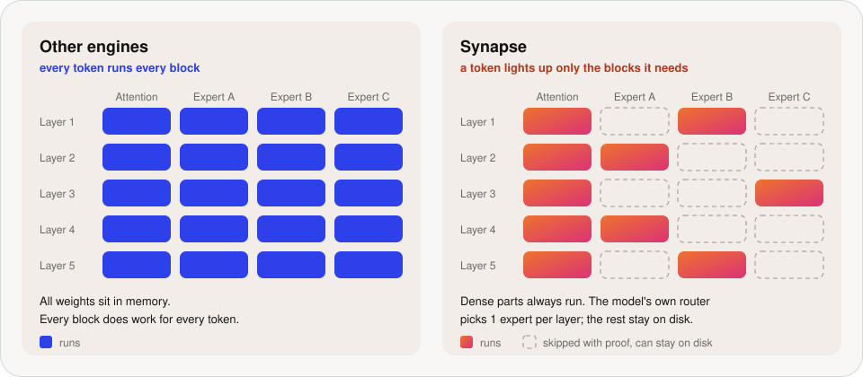
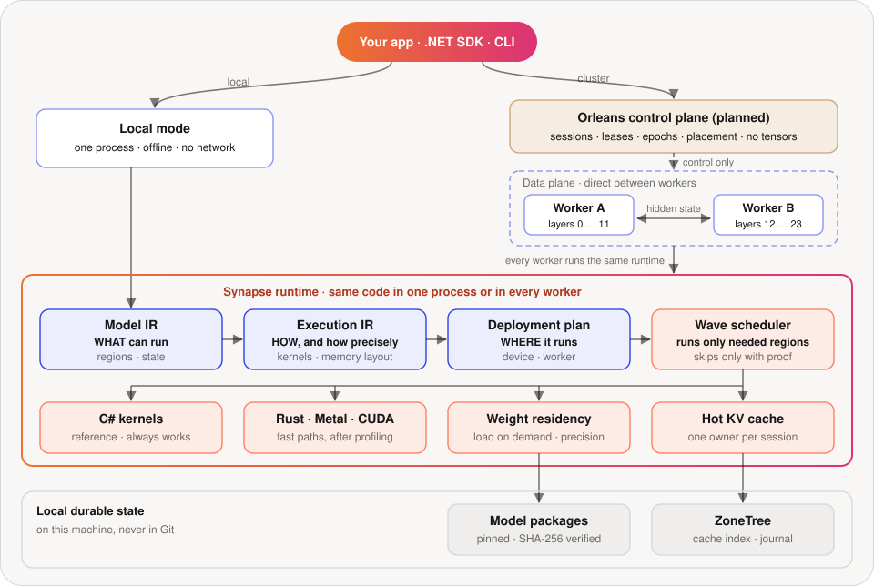
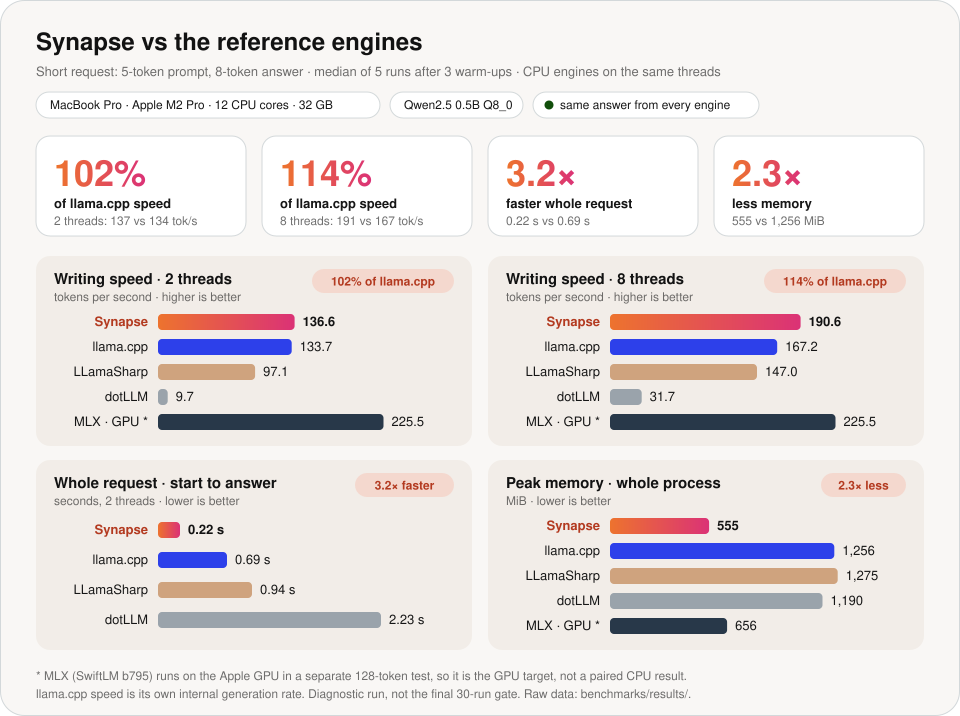
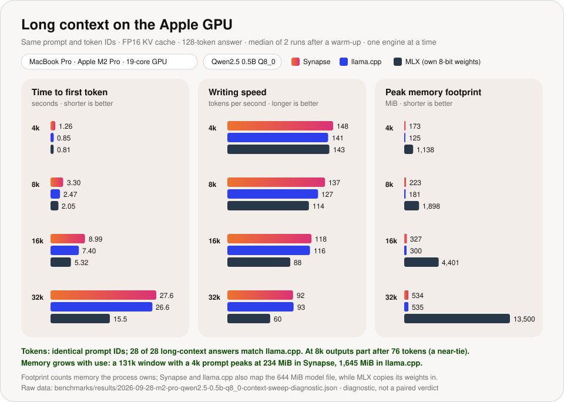
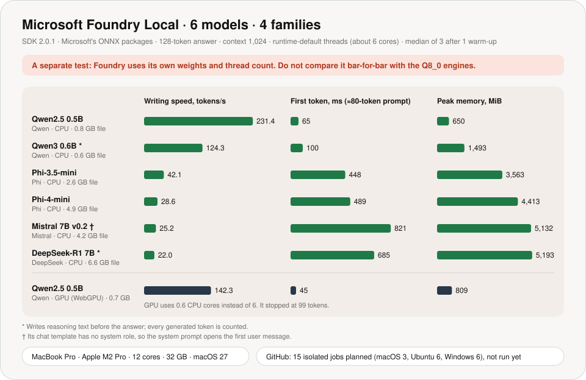
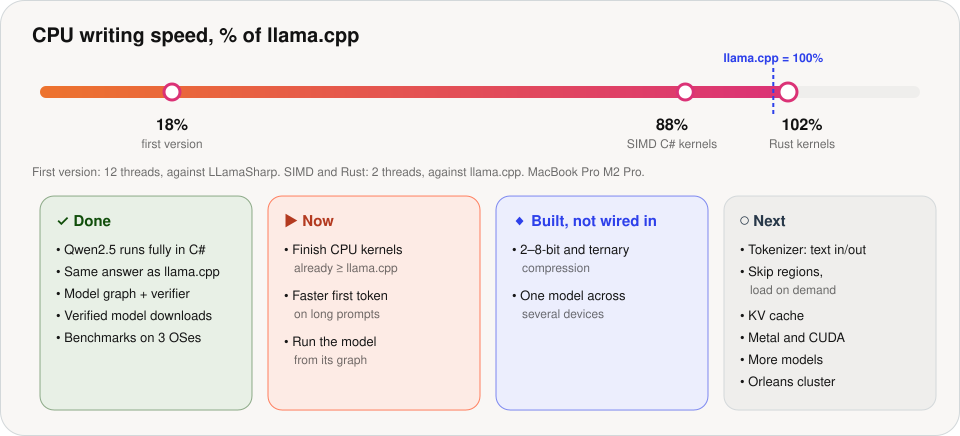

# Synapse

[](https://github.com/managedcode/Synapse/actions/workflows/verify.yml)

**Synapse runs large language models on your own machine, in C# (.NET 10).**
No Python, no server, no network. Later, one model will be split across
several different machines.

## Idea

A fly's brain does not fire every neuron for every signal: a signal takes only
the few regions it needs ([FlyWire connectome](https://doi.org/10.1038/s41586-024-07558-y)).
LLM engines fire everything: every token goes through every block, and every
weight sits in memory. Synapse runs a model like a fly brain.



- **A map of regions:** attention, MLP, each expert, output head.
- **A wave, not a wall:** a token lights up only the regions it needs. A region
  is skipped only with proof: the model's own router, a graph rule, or a
  measured approximation.
- **Cold regions stay on disk** and load on demand, so bigger models fit on
  smaller machines.
- **Precision by importance.** A fast low-precision "reflex" drafts tokens and
  the full model checks them, so the answer stays exact.
- **Regions on different machines.** Only the hidden state travels between
  them: 3.5 KiB per token for Qwen2.5 0.5B.

Today a dense Qwen2.5 runs end to end. Skipping, on-demand loading, and the
cluster are next.

## Architecture



Details: [`docs/Architecture.md`](docs/Architecture.md).

## Benchmark

| Question | Answer |
|---|---|
| Does Synapse write as fast as **llama.cpp**? | **On the local M2 Pro 8-token smoke, yes** (102% at 2 threads, 114% at 8). On hosted M1/x64 runners, its reported decode rate was 54–67% of llama.cpp; at 128 tokens it was slower on all three OSes. |
| Is a whole short request faster? | **Yes in the 8-token smoke.** The local median was 216 ms versus 690 ms; hosted medians were 526–557 ms versus 635–1,671 ms. |
| Does it use less memory? | **Yes in these CPU diagnostics.** The local smoke was 555 MiB versus 1,256 MiB; hosted Synapse used 539–553 MiB versus 575–1,203 MiB. |
| Does it start answering fast? | **For the 5-token smoke prompt, yes.** On the hosted long prompt, Synapse's first token was slower than LLamaSharp on all three OSes even with batched prefill. |
| Does Synapse compute the same thing as **llama.cpp**? | **Yes.** On identical tokens, perplexity matches within 0.01% from 4k to 32k of context, and on the Apple GPU Synapse writes the same tokens (128 of 128 at 4k–16k). |
| Is it as fast on the **Apple GPU** with long context? | **Writing, yes; the first token, not yet.** From 4k to 32k Synapse writes 90–140 tokens/s, level with llama.cpp (93–141); MLX falls to 60 at 32k. The first token takes 1.2–1.6× llama.cpp's time and 1.6–2.1× MLX's. |
| Does it use less memory with long context? | **Same as llama.cpp, 25× less than MLX.** At 32k: 533 MiB peak footprint against 535 (llama.cpp) and 13,500 (MLX). |
| Is the model still right on long prompts? | **As right as a 0.5B model gets.** Synapse, llama.cpp, and MLX give the same answers; the misses (a hidden number at 32k, keys among distractors, variable chains) happen in every engine, so they are the model's limits. |
| How does **Microsoft Foundry Local** do? | **Fast, but quality-limited in this test.** With separate ONNX weights on about 6 cores, Qwen2.5 0.5B reached 231 tokens/s and the 7B models 22–25 tokens/s; none of the 7 model/device variants fully completed the 128-token instruction. |
| Is it faster than the other .NET engine, dotLLM? | **In the same 8-token smoke, 14× faster.** |

### Where it is tested

| Machine | Chip · CPU | RAM | OS | What runs there |
|---|---|---|---|---|
| MacBook Pro (local) | Apple M2 Pro · 12 cores | 32 GB | macOS 27 | Newest code, all engines, MLX on the GPU, Foundry Local (6 models) |
| GitHub `macos-15` | Apple M1 · 3 vCPU | 7 GB | macOS 15 | Committed code; CPU, MLX Metal, and 3 fitting Foundry models measured |
| GitHub `ubuntu-24.04` | x64 · 4 vCPU | 16 GB | Ubuntu 24.04 | Committed code; CPU and all 6 fitting Foundry models measured |
| GitHub `windows-2025` | x64 · 4 vCPU | 16 GB | Windows Server 2025 | Committed code; CPU and all 6 fitting Foundry models measured |

### How it is tested

- Every CPU engine loads the same pinned model file: Qwen2.5 0.5B Instruct, Q8_0.
- Same prompt, greedy decoding, same number of threads.
- Each sample is a fresh process: 3 warm-ups, then 5 measured runs, with the
  engine order rotated every round.
- If any engine gives a different answer, the run fails.

### Local Mac, newest code



What the result says:

- The Rust kernel produced the same eight tokens as llama.cpp in every
  measured round and reached 136.6 versus 133.7 decode tokens/s at two
  threads, then 190.6 versus 167.2 at eight threads.
- The portable SIMD C# kernel reached 124.4 tokens/s at two threads, or 88%
  of llama.cpp's 141.8. The Rust boundary is therefore useful in this measured
  hotspot, while the C# path remains the tested portable implementation.
- This is three warm-ups plus five measurements of an eight-token answer. It
  proves short parity and supplies a diagnostic speed signal; it is not the
  30-pair release verdict and does not establish long-answer quality.
- Batched prefill is implemented. The [hosted 128-token run](https://github.com/managedcode/Synapse/actions/runs/36435838291)
  still shows slower first-token and decode phases than the CPU references;
  the older long-prompt result is no longer the only evidence for this gap.

### GitHub Actions, committed code

[Run `36435838291`](https://github.com/managedcode/Synapse/actions/runs/36435838291)
completed all 20 jobs and retained 22 raw artifacts. Median measured rounds
on each runner (2 CPU threads, same pinned GGUF):

| Runner | 8-token wall: Synapse / llama.cpp | 128-token wall: Synapse / llama.cpp | 128-token reported decode: Synapse / llama.cpp |
|---|---:|---:|---:|
| macOS M1 | 526 / 1,671 ms | 5,856 / 4,223 ms | 32.5 / 59.0 tok/s |
| Ubuntu x64 | 537 / 635 ms | 4,503 / 3,608 ms | 36.5 / 47.0 tok/s |
| Windows x64 | 557 / 681 ms | 4,936 / 3,330 ms | 30.3 / 52.0 tok/s |

All 8-token answers matched. The longer outputs remain quality-unreviewed;
these diagnostics do not pass the 30-pair release gate. The performance
workflow now assembles all raw artifacts into one results-table artifact and
its final GitHub job summary.

### Long context on the Apple GPU



- **Tokens.** Every engine gets the same prompt, and its token IDs are
  checked before its answer counts. Synapse's answers match llama.cpp's
  byte for byte in 28 of 28 long-context questions.
- **Memory.** Synapse keeps the KV cache at 384 MiB for 32k tokens (FP16) and
  maps the model file instead of copying it.
- **Speed.** Writing is level with llama.cpp. The first token is the open gap:
  prompt attention and the prompt matrix multiply are slower. Removing the
  staged K/V tile from prompt attention already cut 32k from 40.5 s to 32.6 s.
- **FP32 KV cache.** Synapse writes 73 tokens/s at 32k, against 10.7 for
  llama.cpp with the same cache type.
- Details, every engine and KV cache type, and CPU rows: runs Q–T in
  [`benchmarks/README.md`](benchmarks/README.md).

### Microsoft Foundry Local, 6 models



- Qwen, Phi, Mistral, and DeepSeek-R1 from Microsoft's Foundry catalog, run
  through the Foundry Local C# SDK. Model list:
  [`foundry-local-families.json`](benchmarks/model-sets/foundry-local-families.json).
- Each model and scenario gets its own fresh process. The context is capped at
  1,024 tokens: by default Foundry reserves memory for the whole context window
  up front (Phi-3.5-mini: 98 GiB, 12 s to the first token).
- On GitHub, every runner and model pair is a separate job, and a model runs
  only where its file fits in half the RAM.
- Manual review of the preserved 128-token outputs found no fully compliant
  result among the seven model/device variants. Qwen3 and DeepSeek-R1 spent the
  budget on reasoning and emitted no final answer; Qwen2.5 CPU and Phi-3.5
  contained factual errors; Phi-4, Mistral, and Qwen2.5 WebGPU left required
  sections or the three-line recap incomplete. These bars measure throughput,
  not answer quality, and are never ranked against the GGUF or MLX cohorts.

### What to improve, and where

| | Problem | Fix | Where |
|---|---|---|---|
| 🔴 | Hosted long-prompt first token and 128-token decode trail the CPU references | Profile prefill and decode on each runner | `experiments/Synapse.ReferenceBenchmarks` |
| 🔴 | Apple GPU first token is 1.2–1.6× llama.cpp's; the prompt matrix multiply alone is 1.55× slower at 512 tokens | Profile the GEMM with GPU counters (tile, half, and layout experiments did not close it) | `native/synapse-gpu/.../metal/shaders/matmul.metal` |
| 🟡 | CPU first token is 1.9× llama.cpp's at 8k | Tiled, vectorized prompt attention | `Qwen2CpuAttention.cs` |
| 🟡 | Smart context (query-aware KV pages) is proven only on CPU: +3.4% perplexity while reading 30% of an 8k context | Metal kernels matched to the C# selection, then measure speed and memory | ADR-016, `KvPageSelector.cs` |
| 🟡 | CUDA is written but has never run | Run CUDA on an NVIDIA machine | `native/synapse-gpu` |
| 🟡 | Free-form long answers are checked for agreement with llama.cpp, not reviewed for content | Human review plus exact-answer gates before release claims | `.github/workflows/performance.yml` |
| 🟡 | Only Qwen2 runs | More model families | `src/Synapse.Runtime/Features/TextGeneration` |
| 🟢 | Speed, memory, startup | Confirm with the 30-run release gate | `experiments/Synapse.ReferenceBenchmarks` |

All runs and raw data: [`benchmarks/README.md`](benchmarks/README.md).

## Plans



Plan files: [`synapse.plan.md`](synapse.plan.md),
[`cpu-kernels.plan.md`](cpu-kernels.plan.md),
[`flybrain.plan.md`](flybrain.plan.md),
[`elastic-inference.plan.md`](elastic-inference.plan.md),
[`kv-performance.plan.md`](kv-performance.plan.md).

## Run it

```bash
dotnet run --project src/Synapse.Cli -- model fetch --set smoke
```

```bash
dotnet run --project src/Synapse.Cli --configuration Release -- generate --model artifacts/models/qwen2.5-0.5b-instruct-q8_0/qwen2.5-0.5b-instruct-q8_0.gguf --tokens 785,6722,315,9625,374 --max-tokens 8
```

Needs .NET SDK 10.0.401 and Rust 1.98.1. All commands are in
[`AGENTS.md`](AGENTS.md#canonical-commands).

## Credits

- **Compared against:** [llama.cpp](https://github.com/ggml-org/llama.cpp),
  [Microsoft Foundry Local](https://github.com/microsoft/Foundry-Local),
  [MLX](https://github.com/ml-explore/mlx-swift-lm) via
  [SwiftLM](https://github.com/SharpAI/SwiftLM),
  [LLamaSharp](https://github.com/SciSharp/LLamaSharp),
  [dotLLM](https://github.com/kkokosa/dotLLM) (GPL-3.0, run as a separate
  process only).
- **Built with:** [.NET](https://github.com/dotnet/runtime),
  [Rust](https://github.com/rust-lang/rust),
  [ZoneTree](https://github.com/ZoneTree/ZoneTree),
  [Orleans](https://github.com/dotnet/orleans),
  [TUnit](https://github.com/thomhurst/TUnit),
  [Qwen2.5](https://huggingface.co/Qwen/Qwen2.5-0.5B-Instruct-GGUF).
- **Ideas from:** [FlyWire connectome](https://doi.org/10.1038/s41586-024-07558-y),
  [Mixture-of-Depths](https://arxiv.org/abs/2404.02258),
  [LayerSkip](https://github.com/facebookresearch/LayerSkip),
  [MoE offloading](https://arxiv.org/abs/2312.17238),
  [BitNet b1.58](https://arxiv.org/abs/2402.17764),
  [BiLLM](https://arxiv.org/abs/2402.04291),
  [SpQR](https://arxiv.org/abs/2306.03078),
  [PTQ1.61](https://arxiv.org/abs/2502.13179),
  [QSpec](https://arxiv.org/abs/2410.11305).
